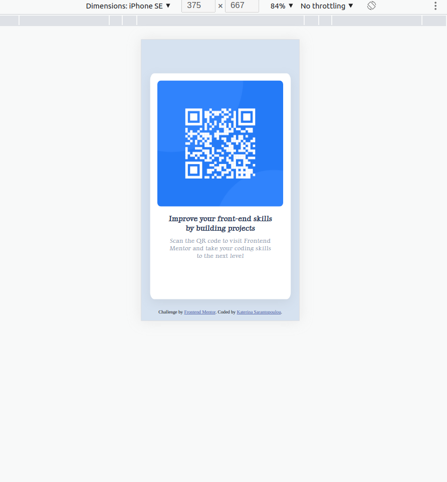
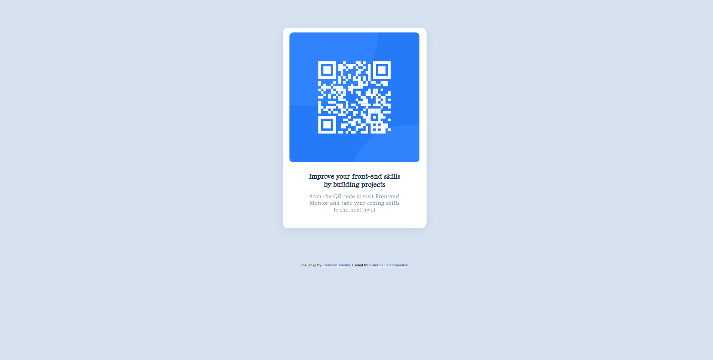

# Frontend Mentor - QR code component solution

This is a solution to the [QR code component challenge on Frontend Mentor](https://www.frontendmentor.io/challenges/qr-code-component-iux_sIO_H). Frontend Mentor challenges help you improve your coding skills by building realistic projects.

## Table of contents

  - [Overview](#overview)
  - [Screenshot](#screenshot)
  - [Links](#links)
  - [My process](#my-process)
  - [Built with](#built-with)
  - [Useful resources](#useful-resources)
  - [Author](#author)

## Overview

I really like this project because it helps me extent
my skills in responsive design and i really enjoyed.
I'm open for any feedback or recommendations .

### Screenshot

### Links

- Solution URL: [Add solution URL here](https://your-solution-url.com)
- Live Site URL: [Add live site URL here](https://your-live-site-url.com)

### Built with

- Semantic HTML5 markup
- CSS custom properties
- Flexbox
- CSS Grid
- Mobile-first workflow

### Useful resources
During this project i visited :
- [Example resource 1](https://css-tricks.com/snippets/css/a-guide-to-flexbox/) - For some guiding about flexbox.
- [Example resource 2](https://getcssscan.com/css-box-shadow-examples) - For Some box-shadow examples.

## Author
- Frontend Mentor - [@kate-sarant](https://www.frontendmentor.io/profile/kate-sarant)
- Twitter - [@KateSarant](https://www.twitter.com/KateSarant)
- Linkedin - linkedin.com/in/aikaterini-sarantopoulou-4b05a51b5
- codepen - codepen.io/https://codepen.io/kate-sarant
